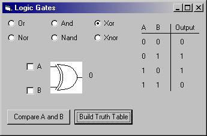



## Logic Gates

### Description

To show how to use logical comparisons in VB. Shows the different symbols for the logic gates[heh, drawn by me...]. Also allows you to see the truth tables. Covers Or, And, Xor, Nor, Nand, and Xnor logic.
 
### More Info
 
An output of 1 or 0 from the logic comparisons

             |
---                |---
**Submitted On**   |2001-10-17 22:29:48
**By**             |[Erik Stites](https://github.com/Planet-Source-Code/PSCIndex/blob/master/ByAuthor/erik-stites.md)
**Level**          |Beginner
**User Rating**    |5.0 (20 globes from 4 users)
**Compatibility**  |VB 5\.0, VB 6\.0
**Category**       |[Miscellaneous](https://github.com/Planet-Source-Code/PSCIndex/blob/master/ByCategory/miscellaneous__1-1.md)
**World**          |[Visual Basic](https://github.com/Planet-Source-Code/PSCIndex/blob/master/ByWorld/visual-basic.md)
**Archive File**   |[Logic Gate327711122001\.zip](https://github.com/Planet-Source-Code/erik-stites-logic-gates__1-28586/archive/master.zip)

